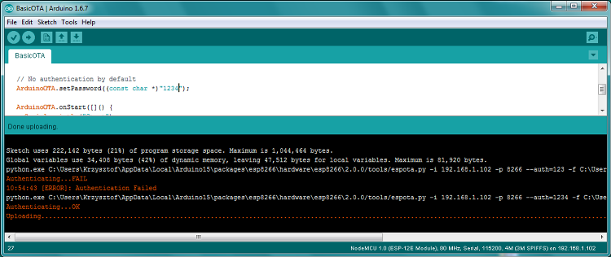
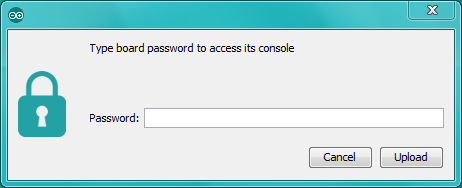
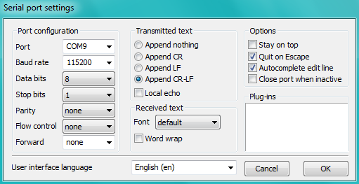
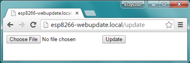
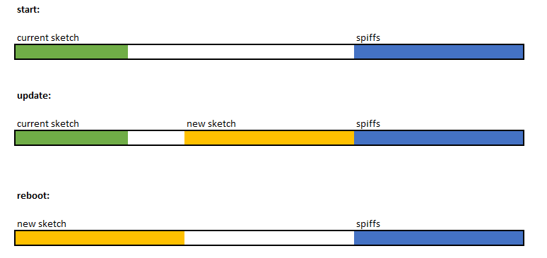

[TOC]

## Giới thiệu OTA

Cập nhật firmware OTA (Over the Air) là tiến trình tải firmware mới vào ESP module thay vì sử dụng cổng Serial. Tính năng này thực sự rất hữu dụng trong nhiều trường hợp giới hạn về kết nối vật lý đến ESP Module.


OTA có thể thực hiện với:

* [Arduino IDE](#arduino-ide)
* [Web Browser](#web-browser)
* [HTTP Server](#http-server)

Sử dụng OTA với tùy chọn dùng **Arduino IDE** trong quá trình phát triển, thử nghiệm, 2 tùy chọn còn lại phù hợp cho việc triển khai ứng dụng thực tế, cung cấp tính năng cập nhật OTA thông qua web hay sử dụng HTTP Server.

Trong tất cả các trường hợp, thì Firmware hỗ trợ OTA phải được nạp lần đầu tiên qua cổng Serial, nếu mọi thứ hoạt động trơn tru, logic ứng dụng OTA hoạt động đúng thì có thể thực hiện việc cập nhật firmware thông qua OTA.

Sẽ không có đảm bảo an ninh đối với quá trình cập nhật OTA bị hack. Nó phụ thuộc vào nhà phát triển đảm bảo việc cập nhật được phép từ nguồn hợp pháp, đáng tin cậy. Khi cập nhật hoàn tấn, ESP8266 sẽ khởi động lại và thực thi code mới. Nhà phát triển phải đảm bảo ứng dụng thực trên module phải được tắt và khởi độn glaij 1 cách an toàn. Nội dung bên dưới cung cấp bổ sung các thông tin về an ninh, và an toàn cho tiến trình cập nhật OTA.

### Bảo mật

Khi ESP8266  được phép thực thi OTA, có nghĩa nó được kết nối mạng không dây và có khả năng được cập nhập Sketch mới. Cho nên khả năng ESP8266 bị tấn công sẽ nhiều hơn và bị nạp bởi mã thực thi khác là rất cao. Để giảm khả năng bị tấn công cần xem xét bảo vệ cập nhật của bạn với một mật khẩu, cổng sử dụng cố định khác biệt, v.v...

Kiểm tra những tính năng được cung cấp bởi thư viện [ArduinoOTA](https://github.com/esp8266/Arduino/tree/master/libraries/ArduinoOTA) thường xuyên, có thể được nâng cấp khả năng bảo vệ an toàn:

```cpp
void setPort(uint16_t port);
void setHostname(const char* hostname);
void setPassword(const char* password);
```

Một số chức năng bảo vệ đã được xây dựng trong và không yêu cầu bất kỳ mã hóa nào cho nhà phát triển. [ArduinoOTA](https://github.com/esp8266/Arduino/tree/master/libraries/ArduinoOTA) và `espota.py` sử dụng [Digest-MD5](https://en.wikipedia.org/wiki/Digest_access_authentication) để chứng thực việc tải firmware lên. Đơn giản là đảm bảo tính toàn vẹn của firmware bằng việc tính [MD5](https://en.wikipedia.org/wiki/MD5).

Hãy phân tích rủi ro cho riêng ứng dụng của bạn bạn và tùy thuộc vào ứng dụng mà quyết định những chức năng cũng như thư viện để thực hiện. Nếu cần thiết, có thẻ xem xét việc thực hiện các phương thức bảo vệ khỏi bị hack, ví dụ như cập nhật OTA chỉ cho tải lên chỉ theo lịch trình cụ thể, kích hoạt OTA chỉ được người dùng nhấn nút chuyên dụng "Cập nhật", v.v...

### An toàn

Quá trình OTA tiêu tốn nguồn tài nguyên và băng thông của ESP8266 khi tải lên. Sau đó, ESP8266 được khởi động lại và một Sketch mới được thực thi. Cần phải phân tích và kiểm tra để Sketch mới không ảnh hưởng tới các chức năng hiện có của Sketch hiện tại, cũng như việc cập nhật OTA lần sau vẫn được đảm bảo.

Nếu ESP8266 được đặt từ xa và kiểm soát một số thiết bị đang vận hành, bạn nên đặt các chú ý đi kèm thông tin những gì sẽ xảy ra nếu hoạt động của thiết bị này đột nhiên bị gián đoạn bởi quá trình cập nhật. Vần phải đưa thiết bị vào trạng thái an toàn trước khi bắt đầu cập nhật. 
Ví dụ ESP8266 của bạn có thể được kiểm soát một hệ thống tưới vườn. Nếu nó không được đóng đúng cách và một van nước bỏ ngỏ, khu vườn của bạn có thể bị ngập và van này không được đóng lại sau khi OTA xong và khởi động lại mô-đun.


Một số hàm sau được cung cấp kèm với thưu viện [ArduinoOTA](https://github.com/esp8266/Arduino/tree/master/libraries/ArduinoOTA) và được dùng để xử lý các chức năng của ứng dụng trong từng giai đoạn cụ thể của OTA hoặc xử lý lỗi OTA:

```cpp
void onStart(OTA_CALLBACK(fn));
void onEnd(OTA_CALLBACK(fn));
void onProgress(OTA_CALLBACK_PROGRESS(fn));
void onError(OTA_CALLBACK_ERROR (fn));
```

### Yêu cầu cơ bản

Kích thước Flash cần đủ để có thể giữ Sketch cũ (hiện đang chạy) và Sketch mới (OTA) cùng một lúc. Xem [flash layout](./filesystem/flash-layout.md#flash-layout).

```cpp
ESP.getFreeSketchSpace();
```

có thể sử dụng cho việc kiểm tra vùng nhớ còn trống cho Sketch mới.

Để có cái nhìn tổng quan về layout bộ nhớ, nơi Sketch mới được lưu trữ và làm thế nào để ESP8266 copy trong quá trình OTA, xem ở [Tiến trình cập nhật - bộ nhớ](#update-process---memory-view).

Phần tiếp theo sẽ cung cấp thông tinh chi tiết cho từng phương thức OTA.

## Arduino IDE

Cập nhật OTA sử dụng Arduino IDE tải firmware lên cho ESP8266 dành cho các tình huống điển hình sau đây:
- Trong quá trình phát triển ứng dụng như một cách thay thế nhanh hơn sử dụng cổng Serial
- Để cập nhật số lượng nhỏ của các module ESP8266
- Chỉ khi module ESP8266 cùng mạng LAN với máy tính chạy Arduino IDE

### Yêu cầu
- Các module ESP8266 và máy tính phải được kết nối với cùng một mạng LAN.

### Ví dụ ứng dụng

Hướng dẫn dưới đây cấu hình chương trình OTA sử dụng board NodeMCU 1.0 (ESP-12E Module). Bạn có thể sử dụng bất kỳ board ESP8266 nào, miễn sao nó đáp ứng được [yêu cầu] (#basic-requirements) được mô tả ở trên. Hướng dẫn này có hiệu lực cho tất cả các hệ điều hành hỗ trợ bởi Arduino IDE. Màn hình chụp đã được thực hiện trên Windows 7 và bạn có thể thấy sự khác biệt nhỏ (như tên của cổng nối tiếp) nếu bạn đang sử dụng Linux và MacOS.

**1.** Trước khi bạn bắt đầu, bạn cần đảm bảo các phần mềm sau đã được cài đặt:
- Arduino IDE 1.6.7 hoặc mới hơn - https://www.arduino.cc/en/Main/Software
- ESP8266/Arduino nền tảng gói 2.0.0 hoặc mới hơn - để được hướng dẫn làm theo https://esp8266.vn/arduino/basic/install/
- Python 2.7 (không cài đặt Python 3.5, nó không được hỗ trợ) - https://www.python.org/

!!! note "Lưu ý"
    Người dùng Windows nên chọn "Add python.exe Path" (xem bên dưới - tùy chọn này không được chọn theo mặc định).


**2.** Bây giờ chuẩn bị cho Sketch mới và cấu hình cho việc  nạp firmware qua cổng nối tiếp.
- Bắt đầu Arduino IDE và mở BasicOTA.ino Sketch sẵn, phần File >  Examples > ArduinoOTA


- Cập nhật SSID và mật khẩu WiFi để ESP8266 có thể kết nối vào mạng Wi-Fi của bạn
![SSID và mật khẩu nhập] (images/a-ota-ssid-pass-entry.png)
        
- Các thông số cấu hình tải lên như bên dưới (bạn có thể cần phải điều chỉnh cấu hình nếu bạn đang sử dụng các module ESP8266 khác):
! [cấu hình tải lên nối tiếp] (images/a-ota-serial-upload-configuration.png)

!!! note "Lưu ý" 
    Tùy thuộc vào phiên bản của gói nền tảng và hội đồng quản trị mà bạn có, bạn có thể thấy `` `Upload Using:` `` trong menu ở trên. Tùy chọn này không hoạt động và nó không quan trọng khi bạn chọn. Nó đã được để lại cho phù hợp với phiên bản cũ của OTA và sẽ bị loại bỏ trong phiên bản 2.2.0.

**3.** Nạp Sketch (Ctrl + U). Sau khi thực hiện, mở tiếp Serial Monitor (Ctrl + Shift + M) và kiểm tra xem ESP8266 đã kết nối vào mạng Wi-Fi của bạn:

![kiểm tra nếu module tham gia mạng] (images/a-ota-upload-complete-and-joined-wifi.png)

**4.** Chỉ khi module ESP8266 được kết nối vào mạng, sau một vài giây, cổng esp8266-ota sẽ hiển thị trong Arduino IDE. Chọn cổng với địa chỉ IP hiện tại hiển thị trên Serial Monitor trong bước trước:

![lựa chọn các cổng OTA] (images/a-ota-ota-port-selection.png)
    
 !!! note "Lưu ý" 
    Nếu cổng OTA không hiện lên, Thoát khảoi Arduino IDE, mở nó một lần nữa và kiểm tra lại. Nếu hoàn toàn không có, thiết lập tường lửa của bạn.

**5.** Bây giờ đã sẵn sàng để cập nhật OTA đầu tiên của bạn bằng cách chọn cổng OTA:

![cấu hình tải lên OTA] (images/a-ota-ota-upload-configuration.png)
    
!!! note "Lưu ý"
    Các mục trình đơn `` `Upload Speed:` `` không quan trọng vào thời điểm này vì nó liên quan đến cổng nối tiếp. Không cần phải tác động

**6.** Nếu bạn đã hoàn thành tất cả các bước trên, bạn có thể tải lên (Ctrl + U) cùng một (hoặc bất kỳ) Sketch qua OTA:

![OTA tải lên hoàn] (images/a-ota-ota-upload-complete.png)

!!! note "Lưu ý" 
    Để có thể tải lên các bản Sketch của bạn nhiều lần hơn nữa sử dụng OTA, bạn cần phải sử dụng các hàm phục vụ OTA bên trong. Vui lòng xem cách sử dụng BasicOTA.ino như là một ví dụ.

#### Bảo vệ mật khẩu

Bảo vệ cập nhật OTA với mật khẩu khá đơn giản. Tất cả việc cần làm là sử dụng đoạn code sau trong mã Sketch:

```cpp
ArduinoOTA.setPassword ((const char *) "123");
```

Với `123` là một mật khẩu mẫu cần được thay thế cho ứng dụng của bạn.

Trước khi thực hiện nó trong Sketch, Bạn có thể thử nghiệm hoạt động OTA bằng việc mở Sketch mẫu **BasicOTA.ino** trong **File > Examples > ArduinoOTA**.  Tiếp theo, mở **BasicOTA.ino**, bỏ comment phía trước phần cấu hình mật khầu (mô tả bên trên). Để xử lý các trường hợp lỗi dễ dàng hơn, không nên sửa đổi mẫu Sketch ngoài trừ các yêu cầu cần thiết. Bao gồm việc đơn giản là sửa mật khẩu OTA `123`  thành mật khẩu của bạn. Rồi cập nhật lên ứng dụng sử dụng OTA. Khi bạn bắt đầu cập nhật OTA, sẽ hiện ra khung hỏi mật khẩu như bên dưới:

![Mật khẩu nhắc để tải lên OTA] (images/a-ota-upload-password-prompt.png)

Nhập mật khẩu và tải lên nên bắt đầu như bình thường, chỉ khác lúc trước là có thêm dòng `Authenticating ...OK ` trong cửa sổ log.

![ Xác thực ...OK trong upload OTA] (images/a-ota-upload-password-authenticating-ok.png)

Bạn sẽ không bị hỏi mật khảu cho lần sau. Arduino IDE sẽ nhớ nó cho bạn. Bạn chỉ thấy dấu khung hỏi mật khẩu chỉ khi mở lại IDE, hoặc nếu bạn thay đổi nó trong Sketch của bạn, tải lên các bản phác thảo và sau đó tải nó lên một lần nữa.

!!! note "Lưu ý"
    Hoàn toàn có khả năng xem lại mật khẩu của lần cập nhật trước bởi Arduino IDE, nếu IDE không bị đóng kể từ lần cập nhật sau cùng. Để thấy được mật khẩu trong cửa sổ Log, thực hiện như sau: Cho phép *Show verbose output during: upload* trong *File > Preferences* và thực hiện việc cập nhật lại.


Hình ảnh trên cho thấy mật khẩu là có thể được nhìn thấy trong Log và nó được gán cho file **espota.py** để thực hiện việc tải firmware.

Ví dụ dưới đây cho thấy tình huống khi mật khẩu được thay đổi giữa các lần cập nhật. 



Khi thực hiện cập nhật, Arduino IDE sử dụng mật khẩu đã nhập trước đó, vì vậy khi không thành công và sẽ báo cáo rõ ràng bởi IDE, IDE sẽ nhắc bạn nhập mật khẩu mới và dùng nó để thực hiện lại việc cập nhật, để đảm bảo thành công.

#### Giải quyết các lỗi thường gặp

If OTA update fails, first step is to check for error messages that may be shown in upload window of Arduino IDE. If this is not providing any useful hints try to upload again while checking what is shown by ESP on serial port. Serial Monitor from IDE will not be useful in that case. When attempting to open it, you will likely see the following:


   
This window is for Arduino Yún and not yet implemented for esp8266/Arduino. It shows up because IDE is attempting to open Serial Monitor using network port you have selected for OTA upload.

Instead you need an external serial monitor. If you are a Windows user check out [Termite](http://www.compuphase.com/software_termite.htm). This is handy, slick and simple RS232 terminal that does not impose RTS or DTR flow control. Such flow control may cause issues if you are using respective lines to toggle GPIO0 and RESET pins on ESP for upload. 

Select COM port and baud rate on external terminal program as if you were using Arduino Serial Monitor. Please see typical settings for [Termite](http://www.compuphase.com/software_termite.htm) below:



Then run OTA from IDE and look what is displayed on terminal. Successful [ArduinoOTA](#arduinoota) process using BasicOTA.ino sketch looks like below (IP address depends on your network configuration):


If upload fails you will likely see errors caught by the uploader, exception and the stack dump, or both. 

The most common causes of OTA failure are as follows:
* not enough physical memory on the chip (e.g. ESP01 with 512K flash memory is not enough for OTA),
* too much memory declared for SPIFFS so new sketch will not fit between existing sketch and SPIFFS – see  [Update process - memory view](#update-process---memory-view),
* too little memory declared in Arduino IDE for your selected board (i.e. less than physical size). 

For more details regarding flash memory layout please check [File system]( https://github.com/esp8266/Arduino/blob/master/doc/filesystem.md).
For overview where new sketch is stored, how it is copied and how memory is organized for the purpose of OTA see [Update process - memory view](#update-process---memory-view).


## Web Browser

Updates described in this chapter are done with a web browser that can be useful in the following typical scenarios:

- after application deployment if loading directly from Arduino IDE is inconvenient or not possible
- after deployment if user is unable to expose module for OTA from external update server
- to provide updates after deployment to small quantity of modules when setting an update server is not practicable


### Requirements

- The ESP and the computer must be connected to the same network.


### Implementation Overview

Updates with a web browser are implemented using ``` ESP8266HTTPUpdateServer ``` class together with ``` ESP8266WebServer ``` and ``` ESP8266mDNS ``` classes. The following code is required to get it work:

setup()

```cpp
    MDNS.begin(host);

    httpUpdater.setup(&httpServer);
    httpServer.begin();

    MDNS.addService("http", "tcp", 80);
```

loop()

```cpp
    httpServer.handleClient();
```


### Application Example

The sample implementation provided below has been done using:

- example sketch WebUpdater.ino available in ``` ESP8266HTTPUpdateServer ``` library
- NodeMCU 1.0 (ESP-12E Module)

You can use another module if it meets previously desribed [requirements](#basic-requirements).


1. Before you begin, please make sure that you have the following software installed:
    - Arduino IDE and 2.0.0-rc1 (of Nov 17, 2015) version of platform package as described under https://github.com/esp8266/Arduino#installing-with-boards-manager
    - Host software depending on O/S you use:
        1. Avahi http://avahi.org/ for Linux
        2. Bonjour http://www.apple.com/support/bonjour/ for Windows
        3. Mac OSX and iOS - support is already built in / no any extra s/w is required

2. Prepare the sketch and configuration for initial upload with a serial port.
    - Start Arduino IDE and load sketch WebUpdater.ino available under File > Examples > ESP8266HTTPUpdateServer.
    - Update SSID and password in the sketch so the module can join your Wi-Fi network.
    - Open File > Preferences, look for “Show verbose output during:” and check out “compilation” option.

        

        **Note:** This setting will be required in step 5 below. You can uncheck this setting afterwards.

3. Upload sketch (Ctrl+U). Once done open Serial Monitor (Ctrl+Shift+M) and check if you see the following message displayed, that contains url for OTA update.

    

    **Note:** Such message will be shown only after module successfully joins network and is ready for an OTA upload.

4. Now open web browser and enter the url provided on Serial Monitor, i.e. http://esp8266-webupdate.local/update. Once entered, browser should display a form like below that has been served by your module. The form invites you to choose a file for update.

    
    
    **Note:** If entering ``` http://esp8266-webupdate.local/update ``` does not work, try replacing ``` esp8266-webupdate ``` with module’s IP address. For example, if your module IP is ``` 192.168.1.100 ``` then url should be ``` http://192.168.1.100/update ```. This workaround is useful in case the host software installed in step 2 does not work. If still nothing works and there are no clues on Serial Monitor, try to diagnose issue by opening provided url in Google Chrome, pressing F12 and checking contents of “Console” and “Network” tabs. Chrome provides some advanced logging on these tabs.

5. To obtain the file navigate to directory used by Arduino IDE to store results of compilation. You can check the path to this file in compilation log shown in IDE debug window as marked below.

    

6. Now press “Choose File” in web browser, go to directory identified in step 5 above, find the file “WebUpdater.cpp.bin” and upload it. If upload is successful you will see “OK” on web browser like below.

    

    Module will reboot that should be visible on Serial Monitor:

    
    
    Just after reboot you should see exactly the same message ``` HTTPUpdateServer ready! Open http:// esp8266-webupdate.local /update in your browser``` like in step 3. This is because module has been loaded again with the same code – first using serial port, and then using OTA.

Once you are comfortable with this procedure go ahead and modify WebUpdater.ino sketch to print some additional messages, compile it, locate new binary file and upload it using web browser to see entered changes on a Serial Monitor.

You can also add OTA routines to your own sketch following guidelines in [Implementation Overview](#implementation-overview) above. If this is done correctly you should be always able to upload new sketch over the previous one using a web browser.

In case OTA update fails dead after entering modifications in your sketch, you can always recover module by loading it over a serial port. Then diagnose the issue with sketch using Serial Monitor. Once the issue is fixed try OTA again.


## HTTP Server

```ESPhttpUpdate``` class can check for updates and download a binary file from HTTP web server.
It is possible to download updates from every IP or domain address on the network or Internet.

#### Requirements
 - web server

#### Arduino code

##### Simple updater

Simple updater downloads the file every time the function is called.

```cpp
ESPhttpUpdate.update("192.168.0.2", 80, "/arduino.bin");
```

##### Advanced updater

Its possible to point update function to a script at the server.
If version string argument is given, it will be sent to the server.
Server side script can use this to check if update should be performed.

Server side script can respond as follows:
- response code 200, and send the firmware image,
- or response code 304 to notify ESP that no update is required.

```cpp
t_httpUpdate_return ret = ESPhttpUpdate.update("192.168.0.2", 80, "/esp/update/arduino.php", "optional current version string here");
switch(ret) {
    case HTTP_UPDATE_FAILED:
        Serial.println("[update] Update failed.");
        break;
    case HTTP_UPDATE_NO_UPDATES:
        Serial.println("[update] Update no Update.");
        break;
    case HTTP_UPDATE_OK:
        Serial.println("[update] Update ok."); // may not called we reboot the ESP
        break;
}
```

#### Server request handling

##### Simple updater

For the simple updater the server only needs to deliver the binary file for update.

##### Advanced updater

For advanced update management a script needs to run at the server side, for example a PHP script.
At every update request the ESP sends some information in HTTP headers to the server.

Example header data:
```
    [HTTP_USER_AGENT] => ESP8266-http-Update
    [HTTP_X_ESP8266_STA_MAC] => 18:FE:AA:AA:AA:AA
    [HTTP_X_ESP8266_AP_MAC] => 1A:FE:AA:AA:AA:AA
    [HTTP_X_ESP8266_FREE_SPACE] => 671744
    [HTTP_X_ESP8266_SKETCH_SIZE] => 373940
    [HTTP_X_ESP8266_SKETCH_MD5] => a56f8ef78a0bebd812f62067daf1408a
    [HTTP_X_ESP8266_CHIP_SIZE] => 4194304
    [HTTP_X_ESP8266_SDK_VERSION] => 1.3.0
    [HTTP_X_ESP8266_VERSION] => DOOR-7-g14f53a19
```

With this information the script now can check if an update is needed. It is also possible to deliver different binaries based on the MAC address for example.

Script example:

```php
<?PHP

header('Content-type: text/plain; charset=utf8', true);

function check_header($name, $value = false) {
    if(!isset($_SERVER[$name])) {
        return false;
    }
    if($value && $_SERVER[$name] != $value) {
        return false;
    }
    return true;
}

function sendFile($path) {
    header($_SERVER["SERVER_PROTOCOL"].' 200 OK', true, 200);
    header('Content-Type: application/octet-stream', true);
    header('Content-Disposition: attachment; filename='.basename($path));
    header('Content-Length: '.filesize($path), true);
    header('x-MD5: '.md5_file($path), true);
    readfile($path);
}

if(!check_header('HTTP_USER_AGENT', 'ESP8266-http-Update')) {
    header($_SERVER["SERVER_PROTOCOL"].' 403 Forbidden', true, 403);
    echo "only for ESP8266 updater!\n";
    exit();
}

if(
    !check_header('HTTP_X_ESP8266_STA_MAC') ||
    !check_header('HTTP_X_ESP8266_AP_MAC') ||
    !check_header('HTTP_X_ESP8266_FREE_SPACE') ||
    !check_header('HTTP_X_ESP8266_SKETCH_SIZE') ||
    !check_header('HTTP_X_ESP8266_SKETCH_MD5') ||
    !check_header('HTTP_X_ESP8266_CHIP_SIZE') ||
    !check_header('HTTP_X_ESP8266_SDK_VERSION')
) {
    header($_SERVER["SERVER_PROTOCOL"].' 403 Forbidden', true, 403);
    echo "only for ESP8266 updater! (header)\n";
    exit();
}

$db = array(
    "18:FE:AA:AA:AA:AA" => "DOOR-7-g14f53a19",
    "18:FE:AA:AA:AA:BB" => "TEMP-1.0.0"
);

if(!isset($db[$_SERVER['HTTP_X_ESP8266_STA_MAC']])) {
    header($_SERVER["SERVER_PROTOCOL"].' 500 ESP MAC not configured for updates', true, 500);
}

$localBinary = "./bin/".$db[$_SERVER['HTTP_X_ESP8266_STA_MAC']].".bin";

// Check if version has been set and does not match, if not, check if
// MD5 hash between local binary and ESP8266 binary do not match if not.
// then no update has been found.
if((!check_header('HTTP_X_ESP8266_SDK_VERSION') && $db[$_SERVER['HTTP_X_ESP8266_STA_MAC']] != $_SERVER['HTTP_X_ESP8266_VERSION'])
    || $_SERVER["HTTP_X_ESP8266_SKETCH_MD5"] != md5_file($localBinary)) {
    sendFile($localBinary);
} else {
    header($_SERVER["SERVER_PROTOCOL"].' 304 Not Modified', true, 304);
}

header($_SERVER["SERVER_PROTOCOL"].' 500 no version for ESP MAC', true, 500);

```


## Stream Interface

TODO describe Stream Interface

The Stream Interface is the base for all other update modes like OTA, http Server / client.


## Updater class

Updater is in the Core and deals with writing the firmware to the flash, 
checking its integrity and telling the bootloader to load the new firmware on the next boot.

### Update process - memory view

 - The new sketch will be stored in the space between the old sketch and the spiff.
 - on the next reboot the "eboot" bootloader check for commands.
 - the new sketch is now copied "over" the old one.
 - the new sketch is started.


