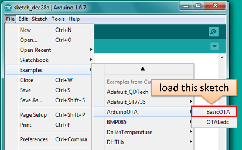
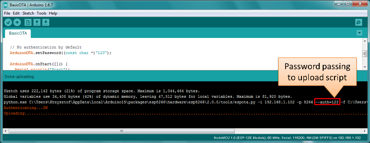
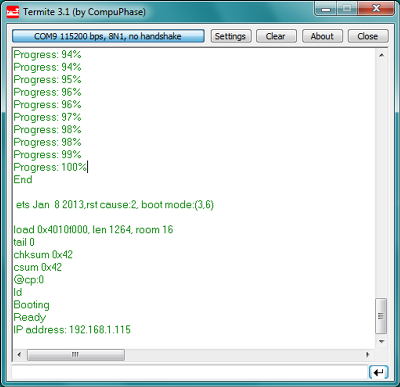

# Arduino IDE

Cập nhật OTA sử dụng Arduino IDE tải firmware lên cho ESP8266 dành cho các tình huống điển hình sau đây:
- Trong quá trình phát triển ứng dụng như một cách thay thế nhanh hơn sử dụng cổng Serial
- Để cập nhật số lượng nhỏ của các module ESP8266
- Chỉ khi module ESP8266 cùng mạng LAN với máy tính chạy Arduino IDE

## Yêu cầu
- Các module ESP8266 và máy tính phải được kết nối với cùng một mạng LAN.

## Ví dụ ứng dụng

Hướng dẫn dưới đây cấu hình chương trình OTA sử dụng board NodeMCU 1.0 (ESP-12E Module). Bạn có thể sử dụng bất kỳ board ESP8266 nào, miễn sao nó đáp ứng được [yêu cầu] (#basic-requirements) được mô tả ở trên. Hướng dẫn này có hiệu lực cho tất cả các hệ điều hành hỗ trợ bởi Arduino IDE. Màn hình chụp đã được thực hiện trên Windows 7 và bạn có thể thấy sự khác biệt nhỏ (như tên của cổng nối tiếp) nếu bạn đang sử dụng Linux và MacOS.

**1.** Trước khi bạn bắt đầu, bạn cần đảm bảo các phần mềm sau đã được cài đặt:
- Arduino IDE 1.6.7 hoặc mới hơn - https://www.arduino.cc/en/Main/Software
- ESP8266/Arduino nền tảng gói 2.0.0 hoặc mới hơn - để được hướng dẫn làm theo [Cài đặt](../basic/install.md)
- Python 2.7 (không cài đặt Python 3.5, nó không được hỗ trợ) - https://www.python.org/

!!! note "Lưu ý"
    Người dùng Windows nên chọn "Add python.exe Path" (xem bên dưới - tùy chọn này không được chọn theo mặc định).


**2.** Bây giờ chuẩn bị cho Sketch mới và cấu hình cho việc  nạp firmware qua cổng nối tiếp.
- Bắt đầu Arduino IDE và mở BasicOTA.ino Sketch sẵn, phần File >  Examples > ArduinoOTA


- Cập nhật SSID và mật khẩu WiFi để ESP8266 có thể kết nối vào mạng Wi-Fi của bạn
![SSID và mật khẩu nhập] (../images/a-ota-ssid-pass-entry.png)
        
- Các thông số cấu hình tải lên như bên dưới (bạn có thể cần phải điều chỉnh cấu hình nếu bạn đang sử dụng các module ESP8266 khác):
! [cấu hình tải lên nối tiếp] (../images/a-ota-serial-upload-configuration.png)

!!! note "Lưu ý" 
    Tùy thuộc vào phiên bản của gói nền tảng và hội đồng quản trị mà bạn có, bạn có thể thấy `Upload Using:`  trong menu ở trên. Tùy chọn này không hoạt động và nó không quan trọng khi bạn chọn. Nó đã được để lại cho phù hợp với phiên bản cũ của OTA và sẽ bị loại bỏ trong phiên bản 2.2.0.

**3.** Nạp Sketch (Ctrl + U). Sau khi thực hiện, mở tiếp Serial Monitor (Ctrl + Shift + M) và kiểm tra xem ESP8266 đã kết nối vào mạng Wi-Fi của bạn:

![kiểm tra nếu module tham gia mạng] (../images/a-ota-upload-complete-and-joined-wifi.png)

**4.** Chỉ khi module ESP8266 được kết nối vào mạng, sau một vài giây, cổng esp8266-ota sẽ hiển thị trong Arduino IDE. Chọn cổng với địa chỉ IP hiện tại hiển thị trên Serial Monitor trong bước trước:

![lựa chọn các cổng OTA] (../images/a-ota-ota-port-selection.png)
    
 !!! note "Lưu ý" 
    Nếu cổng OTA không hiện lên, Thoát khảoi Arduino IDE, mở nó một lần nữa và kiểm tra lại. Nếu hoàn toàn không có, thiết lập tường lửa của bạn.

**5.** Bây giờ đã sẵn sàng để cập nhật OTA đầu tiên của bạn bằng cách chọn cổng OTA:

![cấu hình tải lên OTA] (../images/a-ota-ota-upload-configuration.png)
    
!!! note "Lưu ý"
    Các mục trình đơn `Upload Speed:` không quan trọng vào thời điểm này vì nó liên quan đến cổng nối tiếp. Không cần phải tác động

**6.** Nếu bạn đã hoàn thành tất cả các bước trên, bạn có thể tải lên (Ctrl + U) cùng một (hoặc bất kỳ) Sketch qua OTA:

![OTA tải lên hoàn] (../images/a-ota-ota-upload-complete.png)

!!! note "Lưu ý" 
    Để có thể tải lên các bản Sketch của bạn nhiều lần hơn nữa sử dụng OTA, bạn cần phải sử dụng các hàm phục vụ OTA bên trong. Vui lòng xem cách sử dụng BasicOTA.ino như là một ví dụ.

#### Bảo vệ mật khẩu

Bảo vệ cập nhật OTA với mật khẩu khá đơn giản. Tất cả việc cần làm là sử dụng đoạn code sau trong mã Sketch:

```cpp
ArduinoOTA.setPassword ((const char *) "123");
```

Với `123` là một mật khẩu mẫu cần được thay thế cho ứng dụng của bạn.

Trước khi thực hiện nó trong Sketch, Bạn có thể thử nghiệm hoạt động OTA bằng việc mở Sketch mẫu **BasicOTA.ino** trong **File > Examples > ArduinoOTA**.  Tiếp theo, mở **BasicOTA.ino**, bỏ comment phía trước phần cấu hình mật khầu (mô tả bên trên). Để xử lý các trường hợp lỗi dễ dàng hơn, không nên sửa đổi mẫu Sketch ngoài trừ các yêu cầu cần thiết. Bao gồm việc đơn giản là sửa mật khẩu OTA `123`  thành mật khẩu của bạn. Rồi cập nhật lên ứng dụng sử dụng OTA. Khi bạn bắt đầu cập nhật OTA, sẽ hiện ra khung hỏi mật khẩu như bên dưới:

![Mật khẩu nhắc để tải lên OTA] (../images/a-ota-upload-password-prompt.png)

Nhập mật khẩu và tải lên nên bắt đầu như bình thường, chỉ khác lúc trước là có thêm dòng `Authenticating ...OK ` trong cửa sổ log.

![ Xác thực ...OK trong upload OTA] (../images/a-ota-upload-password-authenticating-ok.png)

Bạn sẽ không bị hỏi mật khảu cho lần sau. Arduino IDE sẽ nhớ nó cho bạn. Bạn chỉ thấy dấu khung hỏi mật khẩu chỉ khi mở lại IDE, hoặc nếu bạn thay đổi nó trong Sketch của bạn, tải lên các bản phác thảo và sau đó tải nó lên một lần nữa.

!!! note "Lưu ý"
    Hoàn toàn có khả năng xem lại mật khẩu của lần cập nhật trước bởi Arduino IDE, nếu IDE không bị đóng kể từ lần cập nhật sau cùng. Để thấy được mật khẩu trong cửa sổ Log, thực hiện như sau: Cho phép *Show verbose output during: upload* trong *File > Preferences* và thực hiện việc cập nhật lại.



Hình ảnh trên cho thấy mật khẩu là có thể được nhìn thấy trong Log và nó được gán cho file **espota.py** để thực hiện việc tải firmware.

Ví dụ dưới đây cho thấy tình huống khi mật khẩu được thay đổi giữa các lần cập nhật. 


Khi thực hiện cập nhật, Arduino IDE sử dụng mật khẩu đã nhập trước đó, vì vậy khi không thành công và sẽ báo cáo rõ ràng bởi IDE, IDE sẽ nhắc bạn nhập mật khẩu mới và dùng nó để thực hiện lại việc cập nhật, để đảm bảo thành công.

#### Giải quyết các lỗi thường gặp

Nếu OTA cập nhật thất bại, bước đầu tiên là kiểm tra các thông báo lỗi được hiển thị trong cửa sổ Log của Arduino IDE. Nếu nó không được cung cấp được bất kỳ gợi ý hữu ích nào, thử cập nhật OTA một lần nữa trong khi kiểm tra thông tin từ ESP8266 được thể hiện trên cổng Serial. Serial Port Monitor từ IDE sẽ không hữu ích trong trường hợp đó. Khi cố gắng để mở nó, bạn có thể sẽ thấy như sau:


   
Cửa sổ này là dành cho Arduino Yun và chưa nâng cấp cho esp8266/Arduino. Nó hiển thị bởi vì IDE đang cố mở tiếp sổ Serial Monitor sử dụng cổng Network mà bạn đã chọn để tải lên OTA.

Thay vào đó bạn cần một chương trình Serial Port Monitor  bên ngoài. Nếu bạn là người dùng Windows, hãy xem qua [Termite](http://www.compuphase.com/software_termite.htm). Khá tiện dụng, thú vị và đơn giản, sử dụng cho thiết bị đầu cuối RS232 mà không áp đặt điều khiển flow control RTS hoặc DTR. Việc sử dụng flow control cho cổng Serial có thể gây ra vấn đề chuyển mức tín hiệu GPIO0 và RESET chân trên ESP8266. 

Chọn cổng COM và tốc độ truyền trên chương trình Serial Port Monitor như khi bạn đang sử dụng Arduino Serial Monitor. Xem các thiết lập tiêu biểu cho [Termite](http://www.compuphase.com/software_termite.htm) dưới đây:


Sau đó chạy OTA từ IDE và nhìn những gì được hiển thị trên Serial Port Terminal. Tiến tình  [ArduinoOTA](https://github.com/esp8266/Arduino/tree/master/libraries/ArduinoOTA) thành công sử dụng BasicOTA.ino Sketch nhìn như bên dưới (địa chỉ IP phụ thuộc vào cấu hình mạng của bạn):



Nếu cập nhật bị lỗi bạn sẽ muốn nhìn thấy nguyên nhân bởi trình tải lên, exception và stack dump, hoặc cả 2 

Các nguyên nhân phổ biến nhất gây thất bại cho việc cập nhật OTA như sau:

- Không đủ bộ nhớ Flash trên chip (ví dụ như ESP01 với bộ nhớ flash 512K là không đủ cho OTA),
- Định nghĩa bộ nhờ Flash quá nhiều cho SPIFFS, Sketch mới sẽ không khớp với Sketch cũ và SPIFFS - xem [Cập nhật quá trình - xem bộ nhớ] #update-process---memory-view),
* Quá ít bộ nhớ Flash được khai báo trong Arduino IDE cho board của bạn (tức là ít hơn so với kích thước vật lý). 

Để biết thêm chi tiết về cách bố trí bộ nhớ flash xin vui lòng kiểm tra [Filesystem](../filesystem/flash-layout.md).
Tổng quan về nơi Sketch mới được lưu trữ, làm thế nào nó được sao chép và tổ chức  bộ nhớ cho mục đích OTA xem như thế nào, xem [Tiến trình cập nhật - Memory view](./arduino-fota.md#update-process-memory-view).
