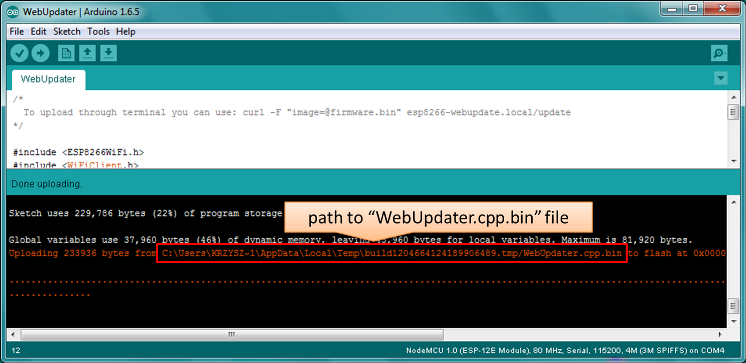
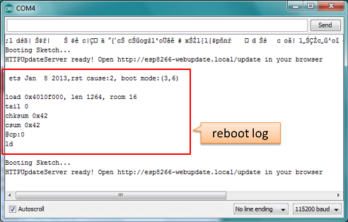

# Trình duyệt Web

Updates described in this chapter are done with a web browser that can be useful in the following typical scenarios:

- after application deployment if loading directly from Arduino IDE is inconvenient or not possible
- after deployment if user is unable to expose module for OTA from external update server
- to provide updates after deployment to small quantity of modules when setting an update server is not practicable


## Requirements

- The ESP and the computer must be connected to the same network.


## Implementation Overview

Updates with a web browser are implemented using ``` ESP8266HTTPUpdateServer ``` class together with ``` ESP8266WebServer ``` and ``` ESP8266mDNS ``` classes. The following code is required to get it work:

setup()

```cpp
    MDNS.begin(host);

    httpUpdater.setup(&httpServer);
    httpServer.begin();

    MDNS.addService("http", "tcp", 80);
```

loop()

```cpp
    httpServer.handleClient();
```


## Application Example

The sample implementation provided below has been done using:

- example sketch WebUpdater.ino available in ``` ESP8266HTTPUpdateServer ``` library
- NodeMCU 1.0 (ESP-12E Module)

You can use another module if it meets previously desribed [requirements](arduino-fota.md#yeu-cau-co-ban).


1. Before you begin, please make sure that you have the following software installed:
    - Arduino IDE and 2.0.0-rc1 (of Nov 17, 2015) version of platform package as described under [Cài đặt](../basic/install.md)
    - Host software depending on O/S you use:
        1. Avahi http://avahi.org/ for Linux
        2. Bonjour http://www.apple.com/support/bonjour/ for Windows
        3. Mac OSX and iOS - support is already built in / no any extra s/w is required

2. Prepare the sketch and configuration for initial upload with a serial port.
    - Start Arduino IDE and load sketch WebUpdater.ino available under File > Examples > ESP8266HTTPUpdateServer.
    - Update SSID and password in the sketch so the module can join your Wi-Fi network.
    - Open File > Preferences, look for “Show verbose output during:” and check out “compilation” option.

        

        **Note:** This setting will be required in step 5 below. You can uncheck this setting afterwards.

3. Upload sketch (Ctrl+U). Once done open Serial Monitor (Ctrl+Shift+M) and check if you see the following message displayed, that contains url for OTA update.

    

    **Note:** Such message will be shown only after module successfully joins network and is ready for an OTA upload.

4. Now open web browser and enter the url provided on Serial Monitor, i.e. http://esp8266-webupdate.local/update. Once entered, browser should display a form like below that has been served by your module. The form invites you to choose a file for update.

    
    
    **Note:** If entering ``` http://esp8266-webupdate.local/update ``` does not work, try replacing ``` esp8266-webupdate ``` with module’s IP address. For example, if your module IP is ``` 192.168.1.100 ``` then url should be ``` http://192.168.1.100/update ```. This workaround is useful in case the host software installed in step 2 does not work. If still nothing works and there are no clues on Serial Monitor, try to diagnose issue by opening provided url in Google Chrome, pressing F12 and checking contents of “Console” and “Network” tabs. Chrome provides some advanced logging on these tabs.

5. To obtain the file navigate to directory used by Arduino IDE to store results of compilation. You can check the path to this file in compilation log shown in IDE debug window as marked below.

    

6. Now press “Choose File” in web browser, go to directory identified in step 5 above, find the file “WebUpdater.cpp.bin” and upload it. If upload is successful you will see “OK” on web browser like below.

    

    Module will reboot that should be visible on Serial Monitor:

    
    
    Just after reboot you should see exactly the same message ``` HTTPUpdateServer ready! Open http:// esp8266-webupdate.local /update in your browser``` like in step 3. This is because module has been loaded again with the same code – first using serial port, and then using OTA.

Once you are comfortable with this procedure go ahead and modify WebUpdater.ino sketch to print some additional messages, compile it, locate new binary file and upload it using web browser to see entered changes on a Serial Monitor.

You can also add OTA routines to your own sketch following guidelines in [Implementation Overview](#implementation-overview) above. If this is done correctly you should be always able to upload new sketch over the previous one using a web browser.

In case OTA update fails dead after entering modifications in your sketch, you can always recover module by loading it over a serial port. Then diagnose the issue with sketch using Serial Monitor. Once the issue is fixed try OTA again.

